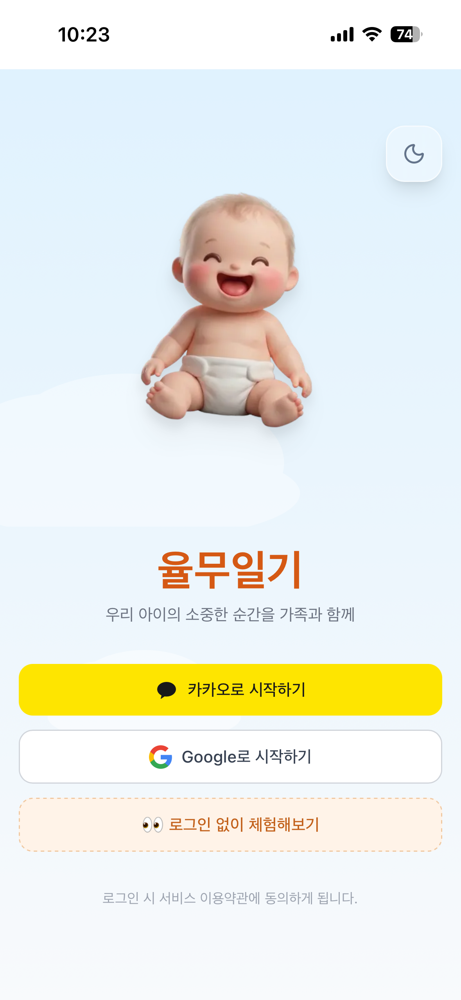
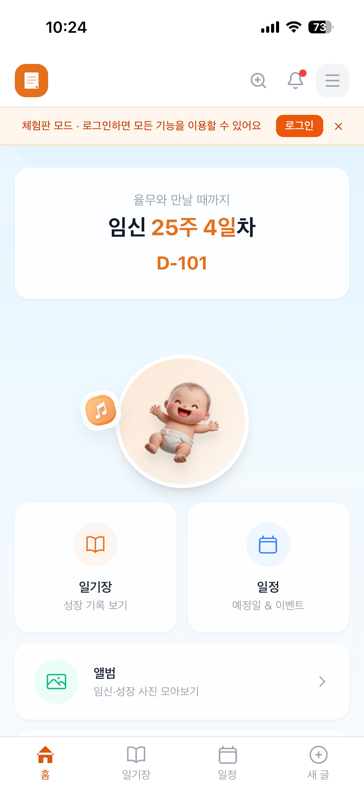
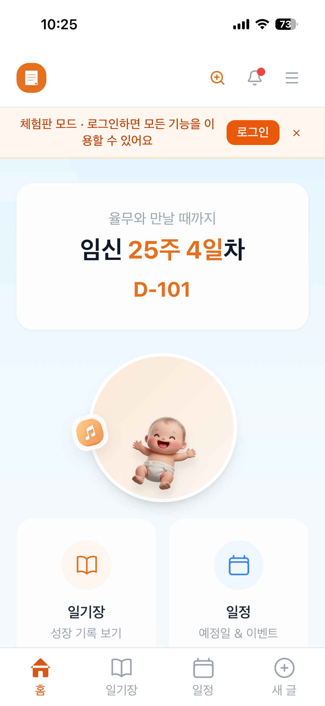
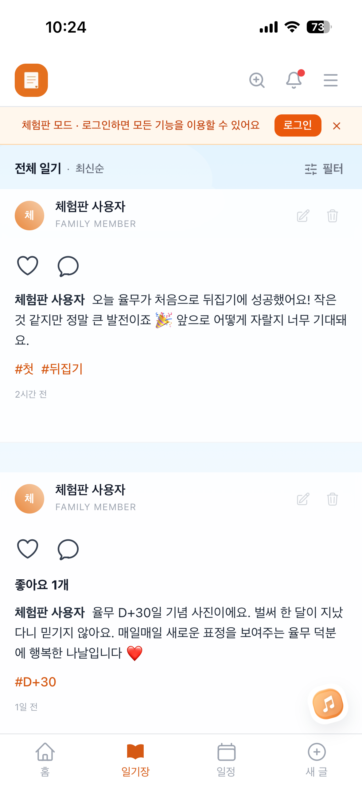
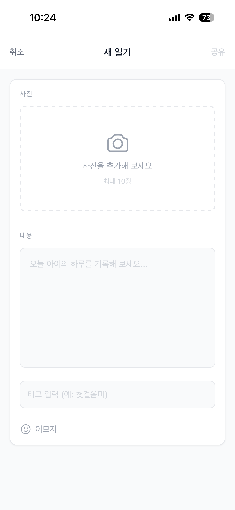
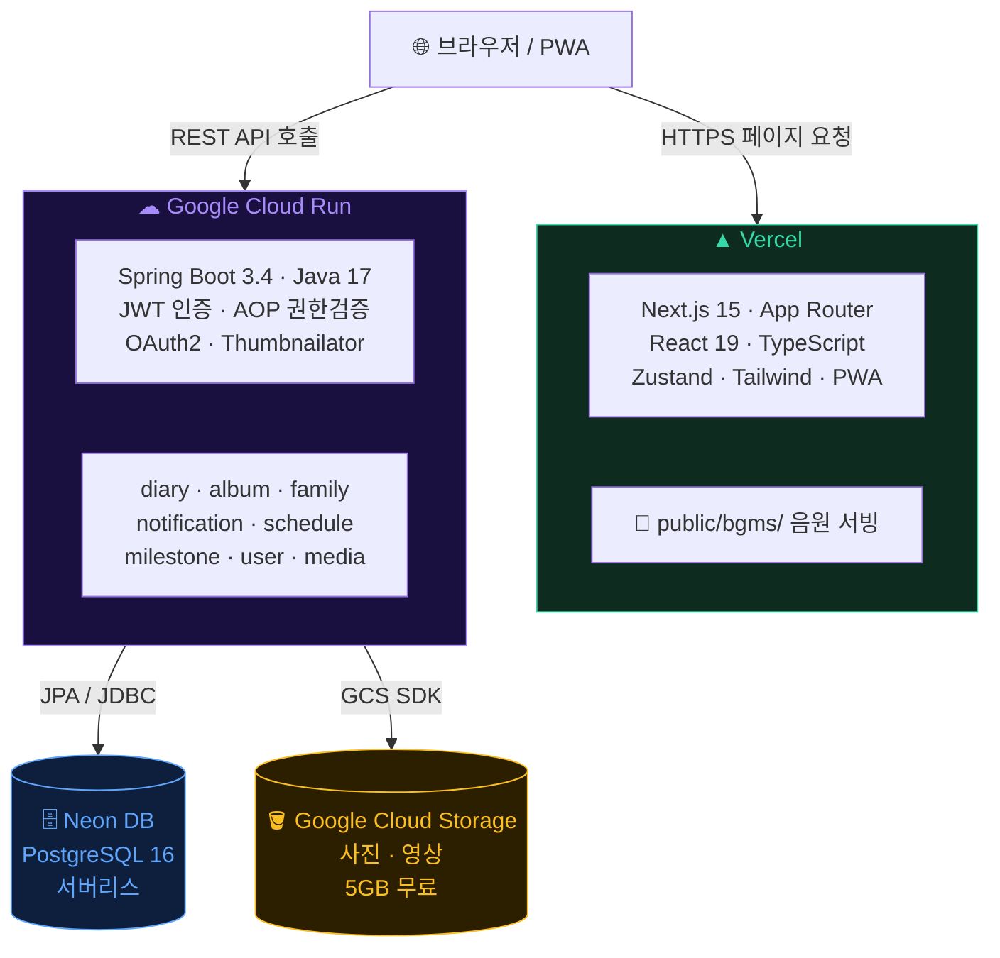

# 👶 율무일기

> 가족과 함께 기록하는 소중한 육아 일기 서비스

---

## 📸 서비스 화면

| 로그인 | 홈 | 글자 확대 모드 | 일기 피드 | 일기 작성 |
|:---:|:---:|:---:|:---:|:---:|
|  |  |  |  |  |

> 📱 [체험판 바로가기](https://yulmu-diary.vercel.app/) — 로그인 없이 둘러보실 수 있습니다.
>
> 체험판은 세션 기반 가상 데이터로 동작합니다. 작성한 일기·댓글·리액션은 브라우저 세션에만 저장되며, 새로고침 시 이미지가 사라질 수 있습니다. SideDrawer의 "체험판 초기화" 버튼으로 데이터를 다시 생성할 수 있습니다.
---

## 💡 기획 의도

아이의 소중한 순간을 가족 모두가 함께 기록하고 나눌 수 있는 공간이 필요했습니다.

특히 **스마트폰 사용이 익숙하지 않은 고령 가족**도 불편함 없이 쓸 수 있도록,
글자 확대 모드, 단순한 UI 구조, 모바일 최적화 PWA를 중심으로 설계했습니다.

---

율무일기는 사진, 영상, 댓글, 리액션을 중심으로 아이의 순간을 기록하고 가족과 공유하는 모바일 최적화 육아 일기 서비스입니다.  
프론트엔드는 Next.js App Router 기반 PWA이고, 백엔드는 Spring Boot REST API로 구성된 모노레포입니다.

---

## ✨ 주요 기능

- 육아 일기 작성: 텍스트, 이미지 업로드
- 가족 그룹 관리: 부모 / 친척 역할 기반 접근 제어
- 소셜 기능: 댓글, 이모지 리액션 (피드에서 댓글·좋아요 수 숫자 표시)
- 소셜 로그인: Google / Kakao OAuth2 로그인
- 일정 관리: 접이식 월별 캘린더, 카카오 장소 검색 연동
- 앨범: 성장 단계별 사진 모아보기, 즐겨찾기
- 성장 이정표: 지하철 노선도 스타일 달성 기록
- 알림: 댓글/리액션 알림, 무한스크롤, 시간 그룹화
- 관리자 기능: 초대 코드 재발급, 멤버 관리, 앱 설정
- 다크모드: 시스템과 독립된 수동 전환, 전체 화면 일관 적용
- PWA 지원: 홈 화면 추가, 모바일 사용성 최적화
- 접근성 확대 모드: 헤더 돋보기 버튼으로 글자 확대
- 배경음악 플레이어:
  - 전역 오디오 싱글톤
  - 홈 hero 옆 고정 토큰
  - 비홈 우하단 floating 플레이어
  - 긴 곡명 marquee 표시

---

## 🛠 기술 스택

### Frontend

| 기술 | 버전 | 역할 |
| --- | --- | --- |
| Next.js | 15 | App Router 기반 프레임워크 |
| React | 19 | UI 컴포넌트 |
| TypeScript | 5.x | 타입 안전성 |
| Tailwind CSS | 3 | 스타일링 |
| Zustand | 5 | 전역 상태 관리 |
| next-themes | 0.4.x | 다크모드 |
| framer-motion | 12.x | 애니메이션 |
| react-kakao-maps-sdk | 1.2.x | 카카오맵 연동 |
| next-pwa | 5.6.x | PWA 설정 |

### Backend

| 기술 | 버전 | 역할 |
| --- | --- | --- |
| Spring Boot | 3.4.1 | REST API 서버 |
| Java | 17 | 런타임 |
| Spring Security | - | JWT 인증 + OAuth2 로그인 |
| Spring Data JPA | - | ORM |
| PostgreSQL | 16 | 메인 데이터베이스 |
| Thumbnailator | 0.4.20 | 이미지 리사이징 |
| springdoc-openapi | 2.8.4 | Swagger 문서 |
| Google Cloud Storage SDK | 2.43.1 | 운영 미디어 저장 |

### Infrastructure

| 구성 요소 | 서비스 |
| --- | --- |
| 프론트엔드 배포 | Vercel |
| 백엔드 배포 | Google Cloud Run |
| 운영 DB | Neon PostgreSQL |
| 로컬 DB | Docker PostgreSQL 16 |
| 미디어 스토리지 | Google Cloud Storage |

---

## 🏗 시스템 아키텍처

---

## 📁 프로젝트 구조

```text
YulmuDiary/
├── backend/
│   ├── build.gradle
│   ├── Dockerfile
│   └── src/main/java/com/yulmudiary/
│       ├── domain/
│       │   ├── album/
│       │   ├── baby/
│       │   ├── diary/
│       │   ├── family/
│       │   ├── health/
│       │   ├── media/
│       │   ├── milestone/
│       │   ├── notification/
│       │   ├── schedule/
│       │   └── user/
│       └── global/
│           ├── admin/
│           ├── auth/
│           ├── config/
│           ├── entity/
│           ├── exception/
│           └── response/
├── frontend/
│   ├── public/
│   │   └── bgms/
│   └── src/
│       ├── app/
│       │   ├── (main)/
│       │   │   ├── album/ + favorites/ + [id]/
│       │   │   ├── diary/
│       │   │   ├── family-manage/
│       │   │   ├── milestones/
│       │   │   ├── my-posts/ + my-comments/ + my-reactions/
│       │   │   ├── notifications/
│       │   │   ├── schedule/
│       │   │   ├── settings/notifications/
│       │   │   └── join/
│       │   ├── auth/ (callback/ + success/)
│       │   ├── login/
│       │   ├── new/
│       │   └── onboarding/
│       ├── components/
│       │   ├── layout/   (Header, BottomNav, SideDrawer)
│       │   ├── diary/    (DiaryFeed, DiaryCard, FilterBar, ImageCarousel, ImageViewer,
│       │   │              CommentBottomSheet, ReactionBar, ReactionUsersSheet 등)
│       │   ├── album/    (AlbumGrid)
│       │   ├── activity/ (PostDetailModal, SquareThumbnailCell)
│       │   ├── ui/       (Skeleton, EmptyState, ConfirmModal, UserAvatar, DatePickerSheet 등)
│       │   └── BgmPlayer, BgmMiniPlayer, BgmFloatingPlayer, BgmPlayerUI, Providers 등
│       ├── contexts/     (FontSizeContext, UserContext)
│       ├── hooks/        (useAuth, usePullToRefresh)
│       ├── lib/          (api, bgmAudio, utils, kakao, demoData)
│       ├── middleware.ts
│       ├── stores/       (authStore, bgmStore, uiStore)
│       └── types/        (index.ts)
├── docker-compose.yml
├── deploy.ps1
├── CLAUDE.md
└── README.md
```

---

## ⚙️ 로컬 개발

### 사전 준비

- Java 17+
- Node.js 18+
- Docker
- Gradle

### 1. PostgreSQL 실행

```bash
docker run -d --name yulmudiary-db -p 5432:5432 -e POSTGRES_DB=yulmudiary -e POSTGRES_USER=postgres -e POSTGRES_PASSWORD=postgres postgres:16
```

### 2. 백엔드 실행

`backend/src/main/resources/application-local.yml` 기준으로 로컬 설정을 확인한 뒤 실행합니다.

```bash
cd backend
gradle bootRun
```

- 백엔드: `http://localhost:8080`
- Swagger UI: `http://localhost:8080/swagger-ui/index.html`

### 3. 프론트엔드 실행

`frontend/.env.local`에 필요한 값을 설정한 뒤 실행합니다.

필수 확인 항목:

- `NEXT_PUBLIC_API_URL`
- `NEXT_PUBLIC_KAKAO_JS_KEY`
- `NEXT_PUBLIC_KAKAO_APP_KEY`

```bash
cd frontend
npm install
npm run dev
```

- 프론트엔드: `http://localhost:3000`

---

## 🚀 배포 자동화 (GitHub Actions)

`backend/**` 경로에 변경이 있을 때 `main` 브랜치에 푸시하면 자동으로 빌드·배포됩니다.

```text
main 브랜치 push (backend/** 변경)
  → Docker 이미지 빌드
  → Artifact Registry 푸시
  → Cloud Run 배포
```

### 인프라 정보

| 항목 | 값 |
|------|-----|
| Registry | `asia-northeast3-docker.pkg.dev/yulmu-project/docker-repo` |
| Cloud Run 서비스명 | `backend-api` |
| 리전 | `asia-northeast3` |

### GitHub Secrets

| 키 | 설명 |
|----|------|
| `GCP_PROJECT_ID` | `yulmu-project` |
| `GCP_SA_KEY` | 서비스 계정 JSON |

### 서비스 계정

- `github-actions-deploy-311@yulmu-project.iam.gserviceaccount.com`
- 필요 권한: Cloud Run 관리자, Artifact Registry 관리자, 서비스 계정 사용자(`iam.serviceAccountUser`)

---

## 🔐 인증 흐름

```text
1. Google 또는 Kakao OAuth2 로그인 요청
2. 백엔드에서 사용자 정보 upsert 후 JWT 발급
3. Access Token은 프론트에서 쿠키 기반 저장
4. Refresh Token은 HttpOnly 쿠키(refresh_token)로 관리
5. API 요청 시 Authorization: Bearer {accessToken}
6. 만료 시 /api/auth/refresh 로 재발급
```

추가로:

- 미들웨어에서 인증 및 가족 그룹 상태를 검사합니다.
- 가족 그룹이 없으면 `/onboarding` 또는 `/join` 흐름으로 이동합니다.

---

## 📡 API 응답 포맷

모든 API 응답은 공통적으로 `ApiResponse<T>` 형식을 사용합니다.

```json
{
  "data": {
    "id": 1
  },
  "error": null
}
```

```json
{
  "data": null,
  "error": {
    "code": "DIARY_NOT_FOUND",
    "message": "해당 일기를 찾을 수 없습니다."
  }
}
```

---

## 👨‍👩‍👧 가족 권한 구조

| 역할 | 일기 조회 | 일기 작성 | 타인 일기 수정/삭제 | 댓글/리액션 | 관리자 기능 |
| --- | --- | --- | --- | --- | --- |
| 부모 (PARENT) | ✅ | ✅ | ✅ | ✅ | ❌ |
| 친척 (RELATIVE) | ✅ | ✅ | ❌ | ✅ | ❌ |
| 관리자 (isAdmin) | ✅ | ✅ | ✅ (전체) | ✅ | ✅ |

- PARENT / RELATIVE는 가족 그룹 내 역할로, 초대 코드 종류에 따라 결정됩니다.
- 관리자(`isAdmin`)는 역할과 독립된 플래그로, 초대 코드 재발급·멤버 강제 퇴출·앱 설정 변경이 가능합니다.
- 백엔드에서는 AOP 기반(`@CheckFamilyAuth`, `@RequireRole`, `@RequireAdmin`)으로 권한을 검증합니다.

---

## 🎵 배경음악 플레이어 메모

- 전역 오디오는 `HTMLAudioElement` 싱글톤으로 관리합니다.
- 재생은 유저가 음표 토큰을 직접 터치할 때만 시작됩니다 (자동재생 없음).
- 홈에서는 hero 옆에 고정된 작은 기울어진 토큰으로 표시됩니다.
- 비홈에서는 우하단 floating 토큰과 확장 미니 플레이어가 표시됩니다.
- 비홈 확장 플레이어에서는 곡명이 길 경우 재생 중에만 marquee가 동작합니다.

### 음원 출처

- 현재 기본 BGM은 **SUNO** 무료 플랜으로 제작한 음원입니다.
- 현재 프로젝트에서는 **비상업적 목적**으로만 사용합니다.

---

## 📱 PWA 구현 노트

### 이미지 저장 — Web Share API 활용

PWA는 브라우저 샌드박스 안에서 동작하기 때문에 OS의 갤러리(파일 시스템)에 직접 접근할 수 없습니다.
네이티브 앱은 Android MediaStore · iOS Photos 프레임워크로 즉시 저장이 가능하지만, PWA에서는 우회가 필요합니다.

| 항목 | 네이티브 앱 | PWA |
|------|------------|-----|
| 갤러리 직접 저장 | OS API로 바로 가능 | 불가 (브라우저 샌드박스) |
| 이미지 다운로드 | 갤러리에 즉시 저장 | blob download → 다운로드 폴더 (갤러리 미노출 가능) |
| 대안 | — | Web Share API → 공유 시트 → "이미지 저장" 선택 |

본 프로젝트에서는 `navigator.canShare({ files })` 지원 여부로 분기합니다.

- **지원 기기 (iOS · Android PWA)**: 공유 시트를 띄워 갤러리 앱으로 저장 가능
- **미지원 기기 (데스크톱 등)**: 기존 blob `<a download>` 방식으로 다운로드 폴더에 저장

---

## 📄 라이선스 / 사용 목적

이 프로젝트는 개인 학습 및 가족 사용 목적의 비상업 프로젝트입니다.
